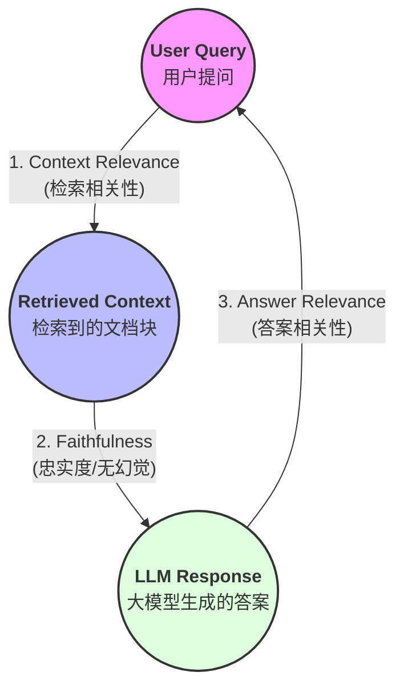

> 本文是 [refine-rag](https://github.com/zonezoen/refine-rag) 系列教程的第x篇，我们来学习一下在写好一个 RAG 系统之后，怎么去评估 RAG 系统？
> 本文所有代码都在：https://github.com/zonezoen/refine-rag

## 前言
废了老大劲，我们完成了 RAG 系统的建设，终于走到评估 RAG 系统这一步了。 RAG 系统的评估是没有精确的标准，就像表示开心词有：高兴、快乐、兴奋、开心
如果大模型使用了同义词来回答问题，难道我们就认为回答是错误的吗？

如果强行使用精确的标准，比如：BLEU & ROUGE（字面重合度）也行，那我们来看看这个例子：
标准答案：我很不开心。
大模型回答：我很开心。

这样大模型回答的所有字都命中标准答案，但是意思却是完全相反的。

## 评估 RAG 的基石
评估一个 RAG 系统不能只看最终答案对不对，因为答案可能是通过大模型的幻觉生成的。那么我们评估 RAG 就要从整个过程来评估。

### 检索相关性
判断检索到的文档是否跟用户提问（User Query）具有相关性。
老师问你“周杰伦的生日”，你能不能从图书馆准确翻出《周杰伦传记》，而不是抱回来一本《周杰伦奶茶店选址指南》。

### 忠实度
判断大模型生成的答案是否忠实于检索到的文档（Retrieved Context）。
是不是基于检索到的文档来生成答案的？就算是检索到的文档说一个月有 40天，那么大模型生成的答案也需要基于这个信息去整理。

### 回答相关性
判断大模型生成的答案（LLM Response）是否跟用户提问具有相关性。
老师问你“周杰伦生日是哪天？”，你回答“周杰伦是一个伟大的音乐人，他在华语乐坛地位很高”。虽然说得都对，但你没正面回答日期，这就是相关性差。

## 检索相关性评估

### 1. 召回率 (Recall)

- **标准解释**：检索到的相关文档数占数据库中所有相关文档总数的比例。
- **通俗解释**：**“不漏掉”**。关于这个问题，全书一共有 3 处重点，你找回来了几处？找全了就是 100% 召回。

### 2. MRR (平均倒数排名)

- **标准解释**：衡量系统将第一个正确答案排在搜索结果第几位的平均表现，计算公式为 $1 / Rank$。
- **通俗解释**：**“首位命中”**。正确答案排第 1，得 1 分；排第 2，得 0.5 分。分数越高，说明你的搜索引擎越“懂我”。

### 3. NDCG (归一化折损累计增益)

- **标准解释**：不仅考虑是否搜到，还根据结果的相关程度分级（如：非常相关、比较相关、无关），并对排名靠后的结果进行对数衰减惩罚。

  - 公式：

    $$DCG_p = \sum_{i=1}^{p} \frac{2^{rel_i} - 1}{\log_2(i+1)}$$

- **通俗解释**：**“黄金位置留给黄金内容”**。它比 MRR 更挑剔，它要求最相关的文档必须待在第一名，次相关的待在第二名，稍微乱一点序都会扣分。

## 回答相关性
### 1. BLEU (Bilingual Evaluation Understudy)

- **标准解释（侧重“精准度”）**：AI 说的话里，有百分之几是标准答案里的？
- **通俗解释**：**“别乱说”**。如果标准答案是“猫在垫子上”，AI 回答“猫在垫子上蹦迪”，“蹦迪”两个词不在标准答案里，BLEU 分数就会下降。

这类评估方法，最早起源于机器翻译。把中文翻译成英文，看翻译出来的结果跟专家翻译的像不像。对于有同义词的回答，也会惨败。

### 2. ROUGE (Recall-Oriented Understudy for Gisting Evaluation)

- **标准解释（侧重“召回率”）**：标准答案里的要点，AI 覆盖到了百分之几？
- **通俗解释**：**“别漏说”**。如果标准答案有 3 个要点，AI 只说出了 1 个，虽然说出的那个词全对，但 ROUGE 分数会很低，因为它漏掉了关键信息。

同样的，ROUGE对于同义词处理也是灾难，用了同义词回答，直接判定为漏回答。

### 3. BERTScore
- **标准解释**：基于向量去做语义相似度的比较。

这个就没有通俗的解释了，从语义相似度的角度做比较，解决了前面两个同义词的问题。

### 4. LLM-as-a-Judge (以模型评模型)

- **标准解释**：使用一个更强大的语言模型（裁判）根据预设的评分准则（Rubrics）对目标模型的输出进行主观评分。
- **通俗解释**：**“请专家批改”**。让 GPT-4o 坐在讲台上，拿着红笔看 DeepSeek 的作业，并给出一个理由和分数。

这类评估方法是怕大模型的幻觉，所以很考验提示词的设计，建议在设计提示词的时候，考虑叫大模型给出评估的依据，基于安全性、逻辑性、易读性给出评分。

## 学习路径

1. 简易RAG 学习
2. LCEL 语法学习
3. LangChain 读取数据
   1. LangChain 读取文本数据
   2. LangChain 读取图片数据
   3. LangChain 读取 PDF 数据
   4. LangChain 读取表格数据
4. 文本切块
5. 向量嵌入
6. 向量存储
7. 检索前处理
8. 索引优化
9. 检索后处理
10. 响应生成
11. 系统评估

## 项目地址

本文所有代码示例都在 GitHub 开源：

https://github.com/zonezoen/refine-rag

欢迎 Star 和 Fork，一起学习 RAG 技术！
