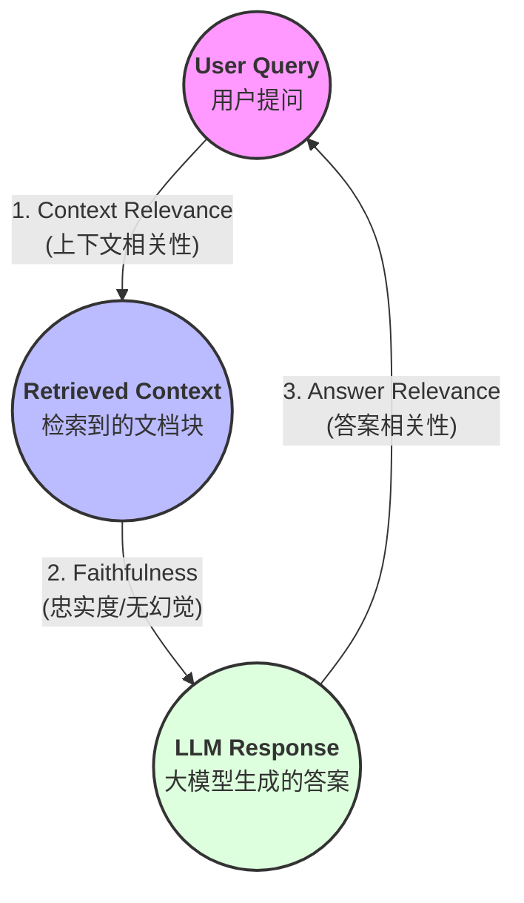

> 本文是 [refine-rag](https://github.com/zonezoen/refine-rag) 系列教程的第二十一篇，我们来学习一下在写好一个 RAG 系统之后，怎么去评估 RAG 系统？
> 本文所有代码都在：https://github.com/zonezoen/refine-rag

## 目录

* 前言
* 评估 RAG 的基石
* 上下文相关性评估：搜得准不准？
* 响应相关性评估：回得好不好？
* 主流评估框架与 RAGAS 实战

---

## 前言

费了老大劲，我们终于把 RAG 系统的“骨架”搭起来了。但接下来这个坑，每个开发者都得跳：**你怎么证明你的 RAG 系统真的好用？**

不管是为了应付老板的 KPI，还是为了在面试时证明你不是只调了个 API，**评估（Evaluation）** 都是必修课。但尴尬的是，RAG 系统的评估没有所谓的“唯一标准答案”。

想象一下，如果用户问“你现在感觉如何？”，大模型回答“我很兴奋”，而标准答案是“我很开心”。

* **语义上**：完全没问题。
* **字面上**：如果强行用传统的 **BLEU** 或 **ROUGE** 这种“连连看”指标去测，AI 就会因为没说出“开心”两个字被判定为失败。

更极端的例子是：

* **标准答案**：我很**不**开心。
* **大模型回答**：我很开心。

看，除了一个“不”字，其他字全中（命中率极高）！但意思却南辕北辙。这就是为什么我们需要一套更科学、更贴合业务的评估体系。

---

## 评估 RAG 的基石

评估一个 RAG 系统不能只盯着最后的答案，因为那可能是大模型的“幻觉”——它凭着记忆瞎猜对了，而不是根据你给的文档回答的。为了拆解这个黑盒，业界公认从三个维度来评估，也就是 **RAG 三元组**。

### 1. 上下文相关性 (Context Relevance)

**判断检索到的文档是否跟用户提问（User Query）具有相关性。或者说检索相关性也可以。**

> **通俗点说**：老师问你“周杰伦的生日”，你能不能从图书馆准确翻出《周杰伦传记》，而不是抱回来一本《周杰伦奶茶店选址指南》。

### 2. 忠实度 (Faithfulness)

**判断大模型生成的答案是否“老老实实”地来自检索到的文档（Context）。**

> **通俗点说**：你得“严谨抄书”。就算检索到的文档里写着“一个月有 40 天”，大模型也得按照这个错误信息去回答，而不是自作聪明地纠正。

### 3. 答案相关性 (Answer Relevance)

**判断大模型生成的答案（LLM Response）是否正面回答了用户的问题。**

> **通俗点说**：老师问“周杰伦生日是哪天？”，你回答“周杰伦是一个伟大的音乐人，地位很高”。虽然没说错，但你没回日期啊！这就叫相关性差。



---

## 上下文相关性评估：搜得准不准？

检索是 RAG 的天花板。如果这一步搜不到，后面 LLM 再聪明也没用。

### 1. Recall (召回率)

* **标准解释**：检索到的相关文档数占数据库中所有相关文档总数的比例。
* **通俗解释**：**“不漏掉”**。关于这个问题，全书一共有 3 处重点，你找回来了几处？
* **使用场景**：当你希望系统**“宁可错杀一千，不可放过一个”**时，重点关注召回率。比如法律或医疗检索。

### 2. MRR (平均倒数排名)

* **标准解释**：衡量系统将第一个正确答案排在搜索结果第几位的平均表现。计算公式为：
$$MRR = \frac{1}{|Q|} \sum_{i=1}^{|Q|} \frac{1}{rank_i}$$


* **通俗解释**：**“首位命中”**。正确答案排第 1，得 1 分；排第 2，得 0.5 分。
* **使用场景**：评估**排序能力**。如果你希望最相关的答案一眼就能被用户看到，这个指标最关键。

### 3. 精确率 (Precision)

* **标准解释**：检索到的文档中，有多少比例是真的相关的。
* **通俗解释**：**“没废话”**。你抱回来 5 本书，如果 4 本都是无关的杂书，那你的精确率就很低。
* **使用场景**：为了节省 LLM 的 Token 消耗。检索出来的废话越少，推理成本就越低。

### 4. P@K (Precision at K)

* **标准解释**：在前 K 个检索结果中的精确度。
* **通俗解释**：**“前几名有多准”**。比如 P@3，就是看前 3 个结果里有几个是有用的。
* **使用场景**：模拟用户行为。大多数用户只看搜索结果的前几个，如果前三个都没有我要的，用户就流失了。

---

## 答案相关性评估：回得好不好？

### 1. BLEU / ROUGE

* **标准解释**：基于词法重合度的传统指标。BLEU 看精准度，ROUGE 看召回率。
* **通俗解释**：**“死脑筋连连看”**。只要字面上没对上，它们就觉得你错了。
* **评价**：在 2026 年的今天，它们更像是一个“辅助”。它们能告诉你 AI 有没有“瞎加词”或“漏关键术语”，但解决不了同义词和逻辑翻转的问题。

### 2. BERTScore

* **标准解释**：利用 BERT 等模型的向量表示，计算生成文本与参考文本的余弦相似度。
* **通俗解释**：**“语义对对碰”**。它不看字，看“意思”在数学空间里离得近不近。
* **评价**：**完美解决了同义词问题**。哪怕你用“开心”，我用“愉悦”，在 BERTScore 的向量世界里，你们就是一对双胞胎，给高分！

### 3. LLM-as-a-Judge (以模型评模型)

* **标准解释**：让一个更强的模型（如 GPT-4o）充当裁判，根据打分量表评分。
* **通俗解释**：**“请专家阅卷”**。
* **评价**：这是目前最接近人类感知的评估方式。

LLM as a Judge 通常也就是评估框架的一部分了。设计提示词（Prompt）时，一定要让裁判给出**理由（Reasoning）**。比如：“请根据逻辑性、安全性、易读性打分，并指出扣分项。” 这样你才能知道你的 RAG 到底弱在哪里。

## 主流RAG评估框架对比
目前主流的评估框架种，大部分都是依赖于前面所说的RAG评估基石：上下文相关性、忠实度、答案相关性，特别是 ragas和trulens。

| 框架名称 | 核心特色 | 优点 | 缺点 | 适用场景 | GitHub star |
| --- | --- | --- | --- | --- | --- |
| **Ragas** | RAG 评估界的“标准库” | 指标非常丰富（如忠实度、相关性）；无需人工标注参考答案即可评估。 | 高度依赖 LLM（如 GPT-4）作为裁判，调用成本较高；对中文支持偶有偏差。 | 追求快速集成、全方位指标衡量的项目。 | 12.8k |
| **TruLens** | 强调“RAG 三元组”模型 | 可视化仪表盘做得非常好；能够监控每个环节的延迟和成本。 | 配置相对复杂一些；UI 界面对大规模数据处理有时会卡顿。 | 需要在开发过程中实时监控并对比不同版本效果。 | 3.1k |
| **DeepEval** | 像写单元测试一样做评估 | 基于 Pytest，对开发者非常友好；指标定义清晰，逻辑严密。 | 社区生态相对于 Ragas 稍小；部分高级功能学习曲线略陡。 | 习惯软件工程测试流程、希望将评估融入 CI/CD 的团队。 | 13.9k |
| **Arize Phoenix** | 专注于“可观测性” | 开源且完全免费；不仅能评估，还能做追踪（Tracing）和分析。 | 主要是针对生产环境的监控，作为纯评估工具时功能显得太重。 | 需要在本地调试检索性能、排查幻觉问题的深度开发者。 | 8.7k |


### DeepEval实例
详情请查看GitHub仓库代码
```python
# 初始化千问模型
qwen_model = QwenModel()

# 定义测试案例
test_case = LLMTestCase(
    input="如果这双鞋不合脚怎么办？",
    actual_output="我们提供30天无理由全额退款服务。",
    expected_output="顾客可以在30天内退货并获得全额退款。",
    retrieval_context=["所有顾客都有资格享受30天无理由全额退款服务。"]
)

# 定义评估指标
contextual_precision = ContextualRelevancyMetric(
    threshold=0.7,
    model=qwen_model,
    include_reason=True
)
answer_relevancy = AnswerRelevancyMetric(
    threshold=0.7,  # 设置阈值，低于0.7视为不通过
    model=qwen_model,  # 使用千问作为评判模型
    include_reason=True  # 包含评分理由
)

# 运行评估
contextual_precision.measure(test_case)
answer_relevancy.measure(test_case)

print("上下文精确度得分: ", contextual_precision.score)
print("理由：", contextual_precision.reason)
print("答案相关性得分: ", answer_relevancy.score)
print("理由：", answer_relevancy.reason)

```


## 学习路径

1. 简易RAG 学习
2. LCEL 语法学习
3. LangChain 读取数据
   1. LangChain 读取文本数据
   2. LangChain 读取图片数据
   3. LangChain 读取 PDF 数据
   4. LangChain 读取表格数据
4. 文本切块
5. 向量嵌入
6. 向量存储
7. 检索前处理
8. 索引优化
9. 检索后处理
10. 响应生成
11. 系统评估

## 项目地址

本文所有代码示例都在 GitHub 开源：

https://github.com/zonezoen/refine-rag

欢迎 Star 和 Fork，一起学习 RAG 技术！
